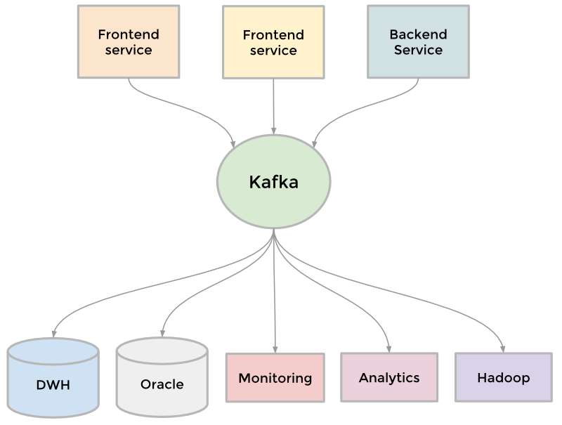

#HSLIDE

#VSLIDE

## Kafka Series

* Architecture
* Points of Difference
* Admin Usecases
* Performance Tuning

#HSLIDE

## What is Kafka

* Distributed, partitioned, and replicated commit log service
  * Add PUB/SUB messaging system functionality
  * Remove LSM (log-structured merge-tree)

#HSLIDE
## Kafka Architecture: Level 0

### Use cases

* Messaging
* Website Activity Tracking
* Metrics
* Log Aggregation
* Stream Processing
* Event Sourcing
* Commit Log

#HSLIDE

## Kafka Architecture: Level 1

* Producer (Push)
* Broker
* Consumer (Pull)

<Broker는 함수. 입구에 topic 이라 써있고, 출구에도 topic 이라 써있다>

#HSLIDE

## Components: Broker

* stateless: consumer가 스스로 얼마나 메시지를 가져갈지 관리. SLA는 빼내는 순서와 관계없이 time-based retention 보장. #pub/sub messaging
* consumer 는 일부러 예전 offset을 통해 읽었던 메시지를 다시 읽을 수 있다. 일반적인 queue의 규칙을 어기는 것이지만 많은 consumer 들이 핵심적으로 사용하는 기능이다.

#VSLIDE
## Components: Topic

토픽은 Producer와 Consumer가 약속한 메시지 이름. 

* 논리적 단위
* #Replication 단위

#HSLIDE
## Kafka Architecture: Level 2

<여러 노드에 분산되서 배치된 그림>

### Components: 파티션

* 분산 단위 (#distributed)
* Consumer가 바라보는 Topic의 실체

#VSLIDE
## Components: Producer

Producer 구현들은 일반적으로 메시지 키에 기반하여 카프카 partition을 선택한다.
* 파티션 이름(주소)을 producer가 알아야 하나?
  * 최초 broker로에게 metadata를 request 해서 받은 내용에 모든 파티션 정보가 담겨있다.
* ZK에 의존하는 부분은?
  * 파티션의 실제 broker 주소?
* 장애 처리
  * leader와 연결이 끊겼을 때, leader election 결과를 받아서 다시 요청하는 부분?
  * message loss 발생 여부?

#VSLIDE
## Components: Consumer

특정 Partition을 순차적으로 읽는다.

#HSLIDE
## Kafka Architecture: Level 3

내부 layer, threading. internals

